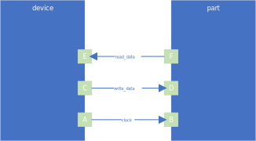

Board Data
==========

The board data data structure contains all the information about trace delays.
It has the following basic structure:

.. code-block:: yaml

    board:
        trace:
            - <trace_name>:
                from_<source>: <pin_name>
                to_<target>: <pin_name>
                delay:
                    max: <max_delay>
                    min: <min_delay>

+------------+--------+---------------------------------------------------------------------+
| Element    |  Type  | Description                                                         |
+------------+--------+---------------------------------------------------------------------+
| trace_name | string | The name of the trace on the board.                                 |
+------------+--------+---------------------------------------------------------------------+
| source     | string | Indicates the start point of the trace.  Either 'device' or 'part'. |
+------------+--------+---------------------------------------------------------------------+
| target     | string | Indicates the end point of the trace.  Either 'device' or 'part'.   |
+------------+--------+---------------------------------------------------------------------+
| pin_name   | string | Name of the pin on the device or part the trace connects to.        |
+------------+--------+---------------------------------------------------------------------+
| max_delay  | float  | The maximum delay of the trace.                                     |
+------------+--------+---------------------------------------------------------------------+
| min_delay  | float  | The minimum delay of the trace.                                     |
+------------+--------+---------------------------------------------------------------------+

Example
-------

The following example will illustrate how to fill out the data structure.

The above image would result in the following YAML file:

.. code-block:: yaml

    board:
        trace:
            - read_data:
                from_part: 'F'
                to_device: 'E'
                delay:
                    max: 1.0
                    min: 0.5
            - write_data:
                from_device: 'C'
                to_part: 'D'
                delay:
                    max: 1.0
                    min: 0.5
            - clock:
                from_device: 'A'
                to_part: 'B'
                delay:
                    max: 1.0
                    min: 0.5
